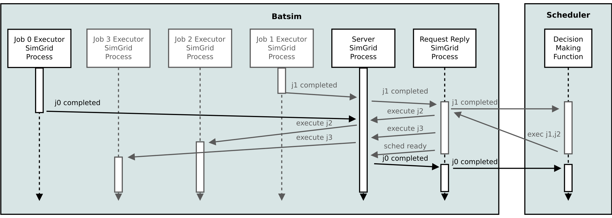

# Case study 1: j1 completion -> execute j2 and j3
In a real system, the scheduling algorithm is called from time to time to
make some decisions.
This case study consists in making the decision to execute two jobs (j2 and j3)
on job j1 completion. However, the decision-making procedure takes some time and
makes the decision in an online fashion: the decision to execute j1 is made
before the decision to execute j2.


## Protocol
In a Batsim simulation, most decisions are taken in another (Linux) process.
This decision-making process will simply be referred to as the Scheduler from now on.

The two processes communicate via a protocol. In this protocol, the Scheduler
must answer one message to each Batsim message. The messages may contain
multiple events. In this case, the messages would be:


### Request message Batsim -> Scheduler
The message from Batsim to the Scheduler is:
``` JSON
{
  "now": 10.000000,
  "events": [
    {
      "timestamp": 10.000000,
      "type": "JOB_COMPLETED",
      "data": {
        "job_id": "d4c32e!1",
        "status": "SUCCESS"
      }
    }
  ]
}
```

The message means that:
- at time 10, job 1 (from workload d4c32e) completed successfully.
- the scheduler has been called at time 10 (``"now": 10.000000``),
  which means that the decisions can be made at time 10 or later on.

### Reply message Scheduler -> Batsim
The scheduler answer is the following:
``` JSON
{
  "now": 15.0,
  "events": [
    {
      "timestamp": 13.0,
      "type": "EXECUTE_JOB",
      "data": {
        "job_id": "d4c32e!2",
        "alloc": "0-1"
      }
    },
    {
      "timestamp": 14.0,
      "type": "EXECUTE_JOB",
      "data": {
        "job_id": "d4c32e!3",
        "alloc": "2-3"
      }
    }
  ]
}
```

This message means that the scheduler:
- (did something until time 13, since the request has been sent at time 10
  and that the first event is at time 13)
- first chose, at time 13, to execute job 2 on machines 0 and 1
- (did something until time 14, since the next event is at time 14)
- then chose, at time 14, to execute job 3 on machines 2 and 3
- (did something until time 15, since the reply has been received at
  ``"now": 15.0``)
- finally chose to stop making decisions for now, at time 15

## What happens within Batsim?
Batsim can be seen as a distributed application composed of different processes.
These processes may communicate with each other, and spawn other processes.

The main process is the **server**. It is started at the beginning of the
simulation, and it ends when the simulation has finished. It orchestrates
most of the other processes:
- **request reply** processes, in charge of communicating with the scheduler
- **job executor** processes, in charge of executing jobs
- **waiter** processes, in charge of handling
  [CALL_ME_LATER](proto_description.md#call_me_later) events

What happens within Batsim for the case study 1 is the following:


First, a **job executor** process finishes to execute job 1. It sends a message
about it to the **server** then terminates. When the server receives the message,
it spawns a **request reply** process to forward that j1 has completed.

The newly spawned **request reply** process sends a network message to
the scheduler, forwarding that j1 has completed. The **request reply** process
then waits for the scheduler reply (the simulation is *stopped* as long as
the reply has not been received).
Once the reply from the scheduler has been received, the **request reply**
process role is to forward the events to the server at the right times.
For this purpose, it sends the events in order, sleeping between events if
needed.

Once all the events have been forwarded, the **request reply** process sends
a ``SCHED_READY`` message to the **server**. This message means that all the
events coming from the scheduler have been sent, and that the scheduler is
now ready to be called if needed.

Events received by the **server** that must be forwarded to the scheduler are
queued in a data structure kept in memory.
If the scheduler is ready, the queued event is sent immediately.
Otherwise, the queued events will be sent as soon as possible,
i.e. when the next ``SCHED_READY`` event will have been received.
This mechanism ensures that scheduler calls are consistent in time:
- if the scheduler replied at time ``t`` (``now`` field of the reply message),
  the next call to the scheduler is ensured to occur at a time greater than or
  equal to ``t``
- when the scheduler is called, it is sure that all its previous decisions
  have been initiated

## What if something happened during the scheduler call?
Please remark that this mechanism implies that schedulers (that wish to take
scheduling time into account) may receive messages from the *past* when they are
called. Indeed, Batsim can send messages whose events occured between the last
call time (``now`` field of the previous request message sent by Batsim) and the
current one (``now`` field of the current request message).

For example, imagine the same scenario as before but with a job 0 that finishes
at time 13.1. The scheduler is making decisions at this time (until time 15).
Hence, the scheduler will finish its decision-making procedure and then be
called as follows:


The Batsim request message would look like:
``` JSON
{
  "now": 15.001000,
  "events": [
    {
      "timestamp": 13.100000,
      "type": "JOB_COMPLETED",
      "data": {
        "job_id": "d4c32e!0",
        "status": "SUCCESS"
      }
    }
  ]
}
```
The message means that:
- job 0 finished at time 13.1 successfully
- the current time is 15.001. Therefore, the scheduler can only make decisions
  at time 15.001 or afterwards.
