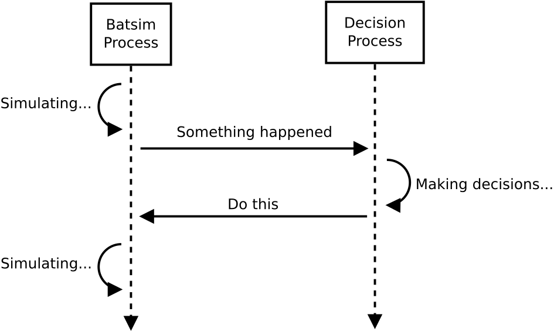
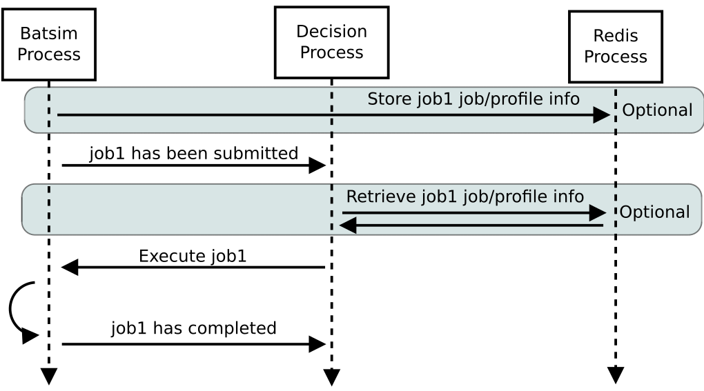
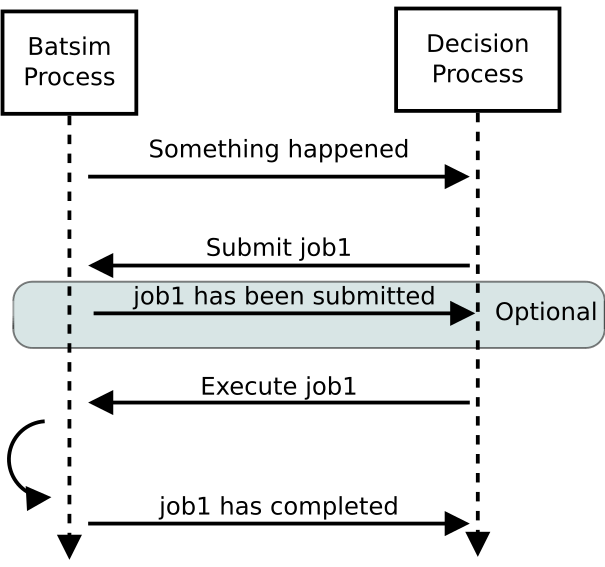
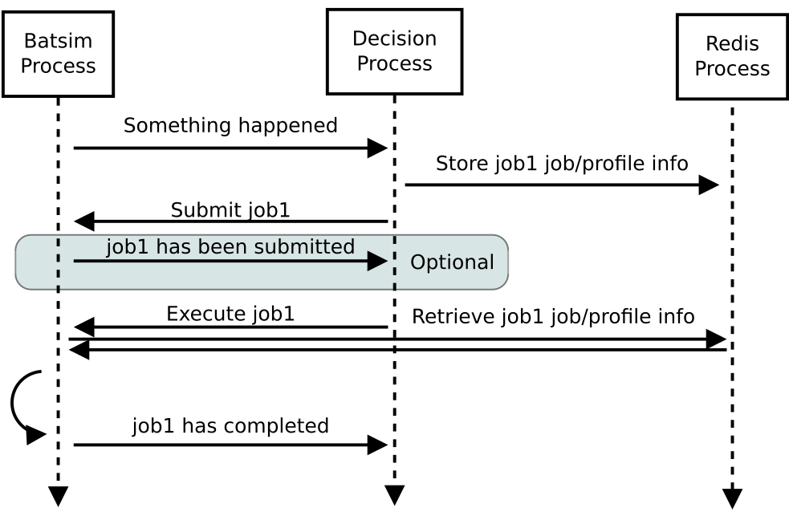

# Introduction
A Batsim simulation consists in two processes:
- Batsim itself, in charge of simulating what happens on the platform
- A *Decision Process* (or more simply scheduler), in charge of making decisions

The two processes communicate via a socket with the protocol explained in
the present document.  The protocol is synchronous and follows a simple
request-reply pattern.  Whenever an event which may require making decision
occurs in Batsim in the simulation, the following steps occur:

1. Batsim suspends the simulation
2. Batsim sends a request to the scheduler (telling it what happened on the
   platform)
3. Batsim waits for a reply from the scheduler
4. Batsim receives the reply
5. Batsim resumes the simulation, applying the decision which have been
   made



ZeroMQ is used in both processes (Batsim uses a ZMQ REQ socket, the
scheduler a ZMQ REP one).

This protocol is used for synchronization purpose. Metadata associated to the
jobs are shared via Redis, as described [here](data_storage_description.md)

# Message Composition

It is a JSON object that looks like this:

```json
{
  "now": 1024.24,
  "events": [
    {
      "timestamp": 1000,
      "type": "EXEC",
      "data": {
        "job_id": "workload!job_1234",
        "alloc": "1 2 4-8",
      }
    },
    {
      "timestamp": 1012,
      "type": "EXEC",
      "data": {
        "job_id": "workload!job_1235",
        "alloc": "12-100",
      }
    }
  ]
}

```

The ``now`` field defines the current simulation time.
- If the message comes from Batsim, it means that the scheduler cannot make
  decisions before ```now``` (time travel is forbidden)
- If the message comes from the scheduler, it tells Batsim that the
  scheduler finished making its decisions at timestamp ```now```. It is
  used by Batsim to know when the scheduler will be available for making
  new decisions.


## Constraints

Constraints on the message format are defined here:

- the message timestamp ``now`` MUST be greater than or equal to every
  event ``timestamp``
- events timestamps MUST be in ascending order: event[i].timestamp <=
  event[i+1].timestamp
- mandatory fields:
    - ``now`` (type: float)
    - ``events``: (type array (can be empty))
        - ``timestamp`` (type: float)
        - ``type`` (type: string as defined below)
        - ``data`` (type: dict (can be empty))

---

## Bidirectional events

These events can be sent from Batsim to the scheduler, or in the opposite
direction.
```
BATSIM <---> DECISION
```

### NOP

The simplest message, stands either for: "nothing happened" if sent by
Batsim, or "do nothing" if sent by the scheduler.

- **data**: empty
- **example**:
```json
{}
```

---

## Batsim to Scheduler events

These events are sent by Batsim to the scheduler.
```
BATSIM ---> DECISION
```

### SIMULATION_BEGINS
Sent at the beginning of the simulation. Once it has been sent,
metainformation can be read from Redis.

- **data**: empty
- **example**:
```json
{
  "timestamp": 0.0,
  "type": "SIMULATION_BEGINS",
  "data": {}
}
```

### SIMULATION_ENDS
Sent once all jobs have been submitted and have completed.

- **data**: empty
- **example**:
```json
{
  "timestamp": 100.0,
  "type": "SIMULATION_ENDS",
  "data": {}
}
```

### JOB_SUBMITTED

Some jobs have been submitted within Batsim. It is sent whenever a job
coming from Batsim inputs (workloads and workflows) are submitted. It is
also sent as a reply to a ```SUBMIT_JOB``` message if and only if an
acknowledgement has been requested.

- **data**: list of job id
- **example**:
```json
{
  "timestamp": 10.0,
  "type": "JOB_SUBMITTED",
  "data": {
    "job_ids": ["w0!1", "w0!2"]
  }
}
```

### JOB_COMPLETED

A job has completed its execution. It acknowledges that the actions coming
from a previous ```EXECUTE_JOB``` message have been done (successfully or
not, depending on whether the job completed without reaching timeout).

- **data**: a job id string with a status string (TIMEOUT, SUCCESS)
- **example**:
```json
{
  "timestamp": 10.0,
  "type": "JOB_COMPLETED",
  "data": {"job_id": "w0!1", "status": "SUCCESS"}
}
```

### JOB_KILLED

Some jobs have been killed. It acknowledges that the actions coming from a
previous ```KILL_JOB``` message have been done.

- **data**: A list of job ids
- **example**:
```json
{
  "timestamp": 10.0,
  "type": "JOB_KILLED",
  "data": {"job_ids": ["w0!1", "w0!2"]}
}
```

### RESOURCE_STATE_CHANGED

The state of some resources has changed. It acknowledges that the actions
coming from a previous ```SET_RESOURCE_STATE``` message have been done.

- **data**: an interval set of resource id and the new state
- **example**:
```json
{
  "timestamp": 10.0,
  "type": "RESOURCE_STATE_CHANGED",
  "data": {"resources": "1 2 3-5", "state": "42"}
}
```

### QUERY_REPLY

This is a reply to a ``QUERY_REQUEST`` message. It depends on the
configuration of Batsim: if ``"redis": { "enabled": true }`` the reply will
go in redis and only the key will be given. Otherwise, the response will be
put directly in the message. See [Configuration documentation](./configuration)
for more details.


- **data**: can be anything
- **example**:
```json
{
  "timestamp": 10.0,
  "type": "QUERY_REPLY",
  "data": {"redis_keys": "/my/key/path0" }
}
```
or
```json
{
  "timestamp": 10.0,
  "type": "QUERY_REPLY",
  "data": {"energy_consumed": "12500" }
}
```

---

## Scheduler to Batsim events
These events are sent by the scheduler to Batsim.
```
BATSIM <--- DECISION
```

### QUERY_REQUEST

This is a query sent to Batsim to get information about the simulation
state (or whatever you want to know...). The supported requests are:
- "energy_consumed" with no argument that asks Batsim about the total
  consumed energy (from time 0 to now) in Joules. Works only in energy
  mode.
- "waiting_time".

- **data**: a dictionnary of requests.
- **example**:
```json
{
  "timestamp": 10.0,
  "type": "QUERY_REQUEST",
  "data": {
    "requests": {"energy_consumed": {}}
  }
}
```

### REJECT_JOB

Reject a job that was submitted before.

- **data**: A job id
- **example**:
```json
{
  "timestamp": 10.0,
  "type": "REJECT_JOB",
  "data": { "job_id": "w12!45" }
}
```

### EXECUTE_JOB

Execute a job on a given set of resources. An optional mapping can be
added to tell Batsim how to map executors to resources: where the
executors will be placed inside the allocation (resource numbers are shifted
to 0). It only works for SMPI for now.

The following example overrides the default round robin mapping to put the
first two ranks (0 and 1) on the first allocated machine (0, which stands for
resource id 2), and the last two ranks (2 and 3) on the second machine (1, which
stands for resource id 3).

- **data**: A job id, an allocation and a mapping (optional)
- **example**:
```json
{
  "timestamp": 10.0,
  "type": "EXECUTE_JOB",
  "data": {
    "job_id": "w12!45",
    "alloc": "2-3",
    "mapping": {"0": "0", "1": "0", "2": "1", "3": "1"}
  }
}
```

### CALL_ME_LATER

Asks Batsim to call the scheduler later on, at a given timestamp.

- **data**: future timestamp float
- **example**:
```json
{
  "timestamp": 10.0,
  "type": "CALL_ME_LATER",
  "data": {"timestamp": 25.5}
}
```


### KILL_JOB
Kills some jobs (almost instantaneously).

- **data**: A list of job ids
- **example**:
```json
{
  "timestamp": 10.0,
  "type": "KILL_JOB",
  "data": {"job_ids": ["w0!1", "w0!2"]}
}
```

### SUBMIT_JOB

Submits a job (from the scheduler).This submission is acknowledged by
default). See [Configuration documentation](./configuration) for more
details.

- **data**: A job id (job id duplication is forbidden), classical job and
  profile information (optional).

- **example redis** : the job description, and the profile description if
  it unknown to Batsim yet, must have been pushed into redis by the
  scheduler before sending this message
```json
{
  "timestamp": 10.0,
  "type": "SUBMIT_JOB",
  "data": {
    "job_id": "w12!45",
  }
}
```
- **example without redis** : the whole job description goes through the protocol.
```json
{
  "timestamp": 10.0,
  "type": "SUBMIT_JOB",
  "data": {
    "job_id": "dyn!my_new_job",
    "job_description":{
      "profile": "delay_10s",
      "res": 1,
      "id": "my_new_job",
      "walltime": 12.0
    },
    "profile_description":{
      "type": "delay",
      "delay": 10
    }
  }
}
```

### SET_RESOURCE_STATE

Sets some resources into a state.

- **data**: an interval set of resource id, and the new state
- **example**:
```json
{
  "timestamp": 10.0,
  "type": "SET_RESOURCE_STATE",
  "data": {"resources": "1 2 3-5", "state": "42"}
}
```

### NOTIFY
The scheduler notify Batsim of something. For example, that job submission
from the scheduler is over, so Batsim is able to stop the simulation.  This
message **must** be sent if ``"scheduler_submission": {"enabled": false}``
is configured. See [Configuration documentation](./configuration) for more
details.

- **data**: empty
- **example**:
```json
{
  "timestamp": 42.0,
  "type": "NOTIFY",
  "data": { "type": "submission_finished" }
}
```

# Use cases
The way to do some operations with the protocol is shown in this section.

## Executing jobs


## Dynamic submission of jobs
Jobs are in most cases submitted within Batsim. It is however possible to submit
jobs from the scheduler. The following two figures described how it should be
done, depending is Redis is used or not.

### Without Redis


### With Redis

