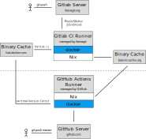

.. _ci:

Continuous Integration
======================

Batsim is tested under Gitlab's continuous integration system.

- Main CI script is :download:`.gitlab-ci.yml <../.gitlab-ci.yml>` (at Batsim's repository root directory).
- CI logs are available on `Batsim's Framagit Pipelines`_.
- Give a look at CI's script to reproduce locally.
  Enable Batsim's Cachix cache to not recompile dependencies: ``cachix add batsim``.

The CI script is the ``.gitlab-ci.yml`` file located at Batsim's repository root directory.

.. _Batsim's Framagit Pipelines: https://framagit.org/batsim/batsim/pipelines
