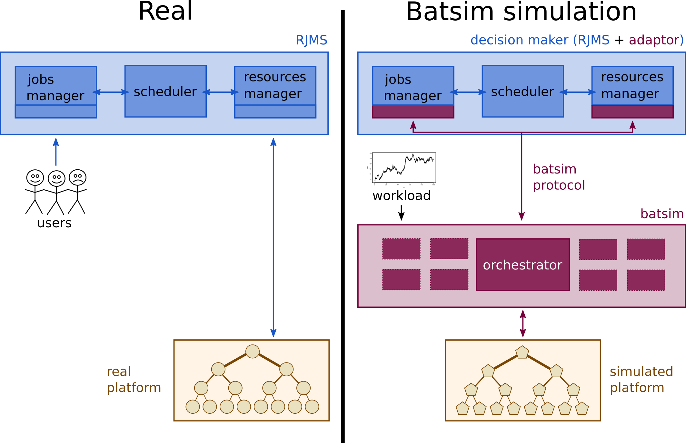

Batsim
======

.. Warning::

   This documentation is under construction.

   Some (most?) parts are still missing but they may be written in our old documentation, probably in the :file:`doc` directory of Batsim's repository
   `there <https://framagit.org/batsim/batsim/tree/master/doc>`_.

   Do feel free to contact us `on mattermost <https://framateam.org/signup_user_complete/?id=5xb995hph3d79yj738pokxrnuh>`_ for any question or remark.

Batsim is a scientific simulator to analyze batch schedulers.
Batch schedulers — or Resource and Jobs Management Systems, RJMSs — are systems that manage resources in large-scale computing centers, notably by scheduling and placing jobs.

- Analyze and compare online scheduling algorithms.
- Sound simulation models thanks to SimGrid_.
- Develop algorithms (in any programming language) without SimGrid knowledge, or to plug existing algorithm implementations to Batsim. Done thanks to a :ref:`protocol` between Batsim and the schedulers
- Several ways to model how jobs should be simulated. Allows multiple levels of realism regarding several phenomena. Highly customizable to your needs.
- Keeping the implementation robust and maintenable is important to us.

.. toctree::
   :maxdepth: 1
   :caption: Tutorials

   Running your first simulation <tuto-first-simulation/tuto.rst>
   Analyzing Batsim results <tuto-result-analysis/tuto.rst>
   Implementing your scheduling algorithm <tuto-sched-implem/tuto.rst>
   Doing a reproducible experiment <tuto-reproducible-experiment/tuto.rst>

.. toctree::
   :maxdepth: 1
   :caption: User Manual

   Installation <installation.rst>
   Command-line interface <cli.rst>
   Protocol <protocol.rst>
   Using Redis <redis.rst>
   Using the I/O model <IO.rst>
   Changelog <changelog.rst>

.. toctree::
   :maxdepth: 1
   :caption: Simulation inputs

   Platform <input-platform.rst>
   Workload <input-workload.rst>

.. toctree::
   :maxdepth: 1
   :caption: Simulation outputs

   Schedule-centric <output-schedule.rst>
   Job-centric <output-jobs.rst>
   Energy-related <output-energy.rst>

.. toctree::
   :maxdepth: 1
   :caption: Developer Manual

   Contributing <contributing.rst>
   Continuous Integration <ci.rst>
   TODO list <todo.rst>

.. _SimGrid: https://simgrid.frama.io/
