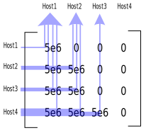

.. _input_workload:

Workload
========

Overview and example
--------------------
Workloads are one of the main Batsim inputs.
They can be used to define what users desire to execute over time.
Batsim separates workloads in two distinct sets that are **jobs** and **profiles**.

- Jobs define user requests. Typically, this is the information the scheduling algorithm can use to make its decisions.
- Profiles define what is inside applications. Typically, this is the information the platform simulator uses to simulate how the application should be executed.

Each job uses exactly one profile. Profiles can be shared by multiple jobs.

Workloads are defined in JSON.
Here is an example of a Batsim workload from Batsim's repository
(:file:`workloads/test_various_profile_types.json`).

.. literalinclude:: ../workloads/test_various_profile_types.json
    :language: json

.. todo::

    - Talk about ``nb_res``. Quick answer: look at the ``--mmax-workload`` option of :ref:`cli`.
    - Tell that other fields can be used freely by users but are ignored by Batsim.

Job definition
--------------
Jobs must have the following fields.

- ``id``: The job unique identifier (string).
- ``subtime``: The time at which the job request is issued in the system (float, in seconds).
- ``res``: The number of resources requested (positive integer).
- ``profile``: The name of the profile associated with the job (string) — i.e., the definition of how the job execution should be simulated.

Some optional fields are used by Batsim.

- ``walltime``: The maximum execution time of the job (float, in seconds). Any job exceeding its walltime is killed by Batsim.

**Users can define any other field as they desire.**
Such information is kept and will be forwarded to the scheduler at the job submission time. The scheduler can then use the additional information.
Here is a **non-exhaustive** list of what this workload definition flexibility allows.

- Defining dependencies between jobs. This can be done by adding a ``dependencies`` field in jobs, which is a list of other job names.
- Constraining where jobs can be executed. For example, users may desire that their jobs are executed as locally as the platforms allows it (e.g., with a ``must_be_local`` boolean). Some other users may ask for a specific set of machines. Some other users may want to indicate that the job can only be used on a special kind of machines (e.g., on GPGPUs)...
- Adding shared resources to the job that are not machines. This is for example the case for proprietary software licenses: The number of concurrent MATLAB executions on a platform may be limited.
- Specifying which queue the job comes from. Please note that giving multiple workloads to Batsim is also possible (see :ref:`cli`).
- Adding metainformation about how the job has been generated. This can be helpful if one wants to assess advanced workload generation techniques.

Profile definition
------------------
Profiles must have the following fields.

- ``type``: The type of profile (string). If the profile is executed by Batsim, Batsim must know the profile type. See `Profile types overview`_ for an overview of the profile types whose execution is directly supported by Batsim.

Other fields may be used by Batsim depending of the profile type.

**Users can define any other field as they desire.**
This is less useful than for jobs, as profiles are usually not forwarded to the scheduler (but it can be enabled, see :ref:`cli`).
It has however proved to be convenient in some situations.
For example, we defined workloads that can be executed both in simulation and on a real distributed systems via OAR_ in `Batsim's initial article`_ thanks to an additional ``command`` field to define how each job should be executed on the real system.

Profile types overview
----------------------

Here are listed the main types of profiles understood by Batsim — in addition to examples for each profile type.

Delay
^^^^^
This is the simplest profile type.
In fact there is no job execution but only a fixed number of seconds during which the machines will sleep.

It does **not** take the platform into account at all. It cannot be used to see any network or CPU contention. It cannot be used directly to observe the energy used by the job — it would be similar to remaining idle.

The following example defines a profile that always waits for 20.20 seconds.

.. code:: json

    {
      "type": "delay",
      "delay": 20.20
    }

.. note::

    In fact, a job execution with the previous delay can be faster than 20.20 seconds if the job's walltime is smaller that 20.20.

.. _profile_parallel:

Parallel task
^^^^^^^^^^^^^
This profile type defines a set of computations and communications whose execution is tightly bound. In other words, at any given time during the profile execution, the progress rate of every communication and computation will be the same.

**Parameters.**

- ``cpu``: An array defining the amount of floating-point operations that should be computed on each allocated machine.
- ``com``: An array defining the amount of bytes that should be transferred between allocated machines. This is in fact a matrix where host in row sends to host in column. When row equals column, the communication is done through the machine loopback interface (if defined in the :ref:`input_platform`).

Here is an example of a parallel task that can be used by any job requesting 4 machines.

.. code:: json

    {
      "type": "parallel",
      "cpu": [5e6,  0,  0,  0],
      "com": [5e6,  0,  0,  0,
              5e6,5e6,  0,  0,
              5e6,5e6,  0,  0,
              5e6,5e6,5e6,  0]
    }

The first allocated machine of such a profile will compute :math:`5 * 10^6` floating-point operations, while the other machines will not compute any floating-point operation. The picture below illustrates the communications done within the parallel task. All allocated machines will send :math:`5 * 10^6` bytes to the first allocated machine. The second allocated machine will send :math:`5 * 10^6` bytes to the first and second allocated machines...

The execution of such profiles is context-dependent.
The computing speed of the machines and the network properties (essentially the bandwidth) is directly taken into account by SimGrid to compute the job execution time.

This profile type allows to observe large-grained interference phenomena between jobs, involving shared computing machines and the bandwidth of shared network nodes.
It can be used to model applications whose execution is very smooth.
Please note that it is probably not realistic enough to observe fine-grained phenomena, such as the impact of network latency when the application heavily relies on short messages that limit its control flow. If you are in such a case, the `SMPI trace replay`_ profile type may interest you.

.. _profile_parallel_homogeneous:

Homogeneous parallel task
^^^^^^^^^^^^^^^^^^^^^^^^^
This profile type is a convenient way to generate an homogeneous `Parallel task`_ that can be used by any job, regardless of the number of machines it requests.

**Parameters.**

- ``cpu``: The amount of floating-point operations that should be computed on each machine.
- ``com``: The amount of bytes to send and receive between each pair of distinct machines. The loopback communication of each machine is set to 0.

.. code:: json

    {
      "type": "parallel_homogeneous",
      "cpu": 10e6,
      "com": 1e6
    }

.. _profile_parallel_homogeneous_total:

Homogeneous parallel task with total amount
^^^^^^^^^^^^^^^^^^^^^^^^^^^^^^^^^^^^^^^^^^^
This profile type is a convenient way to generate an homogeneous `Parallel Task`_ by giving the total amount of work to be done.
It allows such profiles to be used with any number of resources while conserving the same amount of work to do.

.. note::

    This can help modeling moldable jobs with the help of
    :ref:`dynamic_job_registration`.

**Parameters.**

- ``cpu``: The total amount of floating-point operations that should be computed over all nodes. Each node will have an amount of :math:`cpu / node\_count`` floating-point operations to compute, where :math:`node\_count` is the number of nodes allocated to the job.
- ``com``: The amount of bytes that should be sent and received on each pair of distinct nodes. Each node will send and receive an amount of :math:`com / node\_count` bytes. The loopback communication of each node is set to 0.

.. code:: json

    {
      "type": "parallel_homogeneous_total",
      "cpu": 10e6,
      "com": 1e6
    }

Sequence of profiles
^^^^^^^^^^^^^^^^^^^^
This profile type defines a list of other profiles that should be executed in sequence.

**Parameters.**

- ``seq``: The array of profile names that should be executed.
- ``repeat`` (optional): The number of times the sequence will be repeated. By default, the sequence is only executed once (value is 1).

.. code:: json

    {
      "type": "composed",
      "repeat" : 4,
      "seq": ["prof1","prof2","prof1"]
    }

.. _profile_parallel_homogeneous_pfs:

Homogeneous parallel tasks with IO to/from a Parallel File System
^^^^^^^^^^^^^^^^^^^^^^^^^^^^^^^^^^^^^^^^^^^^^^^^^^^^^^^^^^^^^^^^^
Represents an IO transfer between all the nodes of a job's allocation and a
centralized storage tier. The storage tier is represented by one host of the :ref:`input_platform`.

**Parameters.**

- ``bytes_to_read``: The amount of bytes to read from the PFS to each node (float).
- ``bytes_to_write``: The amount of bytes to write to the PFS from each node (float).
- ``storage``: (optional) The name of the storage (string). It will be mapped to a specific node at the job execution time. Default value is ``pfs``. See :ref:`proto_EXECUTE_JOB` for more details.

.. code:: json

    {
      "type": "parallel_homogeneous_pfs",
      "bytes_to_read": 10e5,
      "bytes_to_write": 10e5,
      "storage": "nfs"
    }

Staging parallel tasks between two storage tiers
^^^^^^^^^^^^^^^^^^^^^^^^^^^^^^^^^^^^^^^^^^^^^^^^
This profile type represents an IO transfer between two storage tiers.

.. todo::

    - What is a storage tier in this case? One host of the :ref:`input_platform`?
    - Link with execution message that manages the label->id label.

**Parameters.**

- ``nb_bytes``: The amount of bytes to be transferred (float).
- ``from``: The name of the sending storage tier (string). It will be mapped to a specific machine at the job execution time.
- ``to``: The name of the receiving storage tier (string). It will be mapped to a specific machine at the job execution time.

See :ref:`proto_EXECUTE_JOB` for more details on the storage mapping needed for
both the ``to`` and the ``form`` fields.

.. code:: json

    {
      "type": "data_staging",
      "nb_bytes": 10e5,
      "from": "pfs",
      "to": "nfs"
    }

SMPI trace replay
^^^^^^^^^^^^^^^^^
Profiles of this type correspond to the replay of a SMPI time-independent trace. Such traces allow to see the fine-grained behavior of MPI applications.

.. note::

    This profile type may not be realistic with all applications, as the application is simulated *offline*: The application is first executed to get a trace, then the trace is replayed.

    This may be wrong if the application logic depends on the execution context, for example if the application communication pattern depends on the observed latencies at runtime.

**Parameters.**

- ``trace``: The file name of the main trace file (string).

.. warning::

    As I write these lines, the ``trace`` filename must be relative to the Batsim workload file in which the profile is defined.

    As a full example, refer to the trace in :file:`workloads/smpi/compute_only`
    and to the :file:`workloads/test_smpi_compute_only.json` workload file.

.. code:: json

    {
      "type": "smpi",
      "trace": "smpi/compute_only/traces.txt"
    }

.. _OAR: https://oar.imag.fr/start
.. _Batsim's initial article: https://hal.archives-ouvertes.fr/hal-01333471
