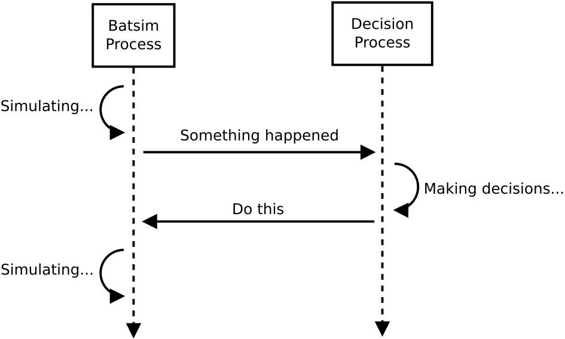
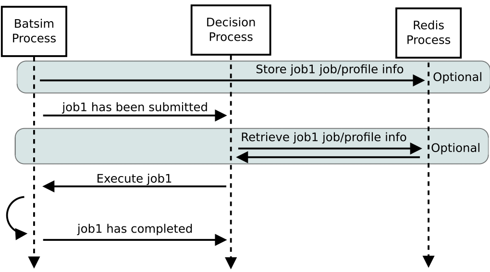
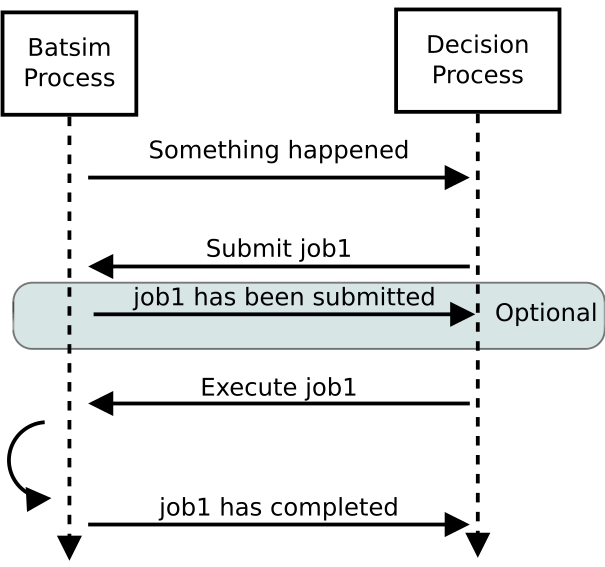
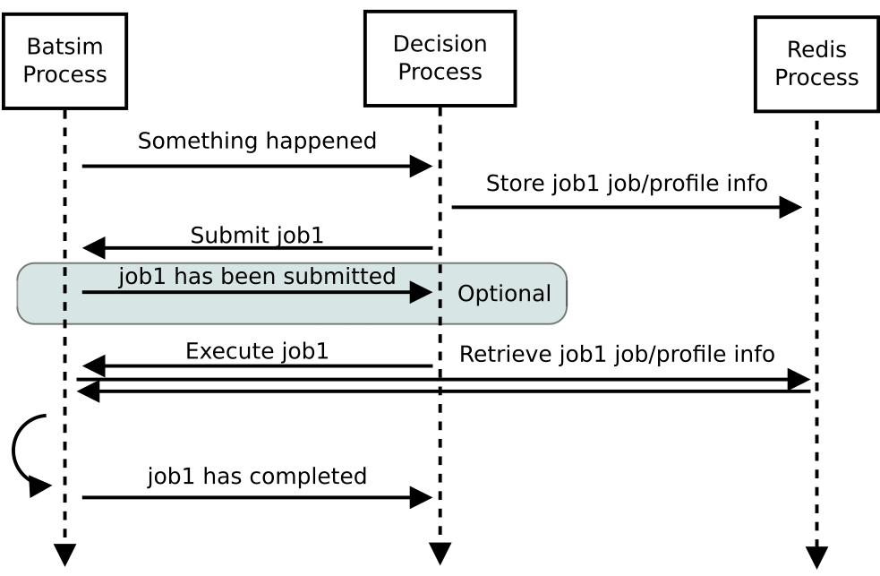

.. _protocol:

Protocol
========

A Batsim simulation consists in two processes.

- Batsim itself, in charge of simulating what happens on the platform.
- A *Decision Process* (or more simply scheduler), in charge of making decisions.

The two processes communicate via a socket with the protocol explained in the present document.
The protocol is synchronous and follows a simple request-reply pattern.
Whenever an event which may require making decision occurs in Batsim in the simulation, the following steps occur.

1. Batsim suspends the simulation
2. Batsim sends a request to the scheduler (telling it what happened on the platform)
3. Batsim waits for a reply from the scheduler
4. Batsim receives the reply
5. Batsim resumes the simulation, applying the decision which have been made

Communication is implemented using the `ZeroMQ request-reply pattern`_.
Batsim uses a ZMQ REQ socket to send requests to the schedulers.
The scheduler uses a ZMQ REP socket.

The behavior of this protocol depends on Batsim :ref:`cli`.

- If Redis is enabled, job metadata is stored into a Redis server and not sent through the protocol.
  In this case, the protocol is only used for synchronization purposes.
  More information about Redis conventions are described in :ref:`redis`.
- Batsim may or may not forward job profile information to the scheduler when jobs are submitted (see JOB_SUBMITTED_ documentation).
- Dynamic jobs (and profile) registration can be enabled or disabled.
  Many parameters of jobs registration can be adjusted.
  Please refer to `Dynamic registration of jobs`_ for more details.

Message Composition
-------------------

Each message is a JSON object that looks like this.

.. code:: json

   {
     "now": 1024.24,
     "events": [
       {
         "timestamp": 1000,
         "type": "EXECUTE_JOB",
         "data": {
           "job_id": "workload!job_1234",
           "alloc": "1 2 4-8",
         }
       },
       {
         "timestamp": 1012,
         "type": "EXECUTE_JOB",
         "data": {
           "job_id": "workload!job_1235",
           "alloc": "12-100",
         }
       }
     ]
   }

The ``now`` field defines the current simulation time.

- If the message comes from Batsim, it means that the scheduler cannot make decisions before ``now`` as it would change the past.
- If the message comes from the scheduler, it tells Batsim that the scheduler finished making its decisions at timestamp ``now``.
  This is used by Batsim to know when the scheduler will be available for making new decisions.

The ``events`` field defines a sequence of events.
The various event types are defined in the present document.
See `Table of Events`_ for a quick list.

Constraints
-----------

Constraints on the message format are defined here.

-  The message timestamp ``now`` **must** be greater than or equal to every
   event ``timestamp``.
-  Events timestamps **must** be in (non-strictly) ascending order.
-  The following fields are mandatory in the message main object.

   -  ``now`` of float type.
   -  ``events`` of array type. Can be empty.

      -  ``timestamp`` of float type.
      -  ``type`` of string type. Value must be valid (see `Table of Events`_).
      -  ``data`` of object type. Value depends on the event ``type`` (see `Table of Events`_).

Table of Events
---------------

-  Bidirectional

   - QUERY_
   - ANSWER_
   - NOTIFY_

-  Batsim to Scheduler

   - SIMULATION_BEGINS_
   - SIMULATION_ENDS_
   - JOB_SUBMITTED_
   - JOB_COMPLETED_
   - JOB_KILLED_
   - RESOURCE_STATE_CHANGED_
   - REQUESTED_CALL_

-  Scheduler to Batsim

   - REJECT_JOB_
   - EXECUTE_JOB_
   - CALL_ME_LATER_
   - KILL_JOB_
   - REGISTER_JOB_
   - REGISTER_PROFILE_
   - SET_RESOURCE_STATE_
   - SET_JOB_METADATA_
   - CHANGE_JOB_STATE_

Bidirectional events
--------------------

These events can be sent from Batsim to the scheduler, or in the
opposite direction.

QUERY
~~~~~

This event allows a peer to ask specific information to its
counterpart. The other peer should answer to such a QUERY_ via an ANSWER_.

For now, Batsim **answers** to the following requests.

- ``consumed_energy``: The scheduler queries Batsim about the total consumed energy (from time 0 to now) in Joules. This query has no argument. Only works if the energy mode is enabled (see :ref:`cli`).

..
    - ``air_temperature_all`` The scheduler queries Batsim about the ambient air temperature of all hosts. Only works if the temperature mode is enabled (see :ref:`cli`).
    - ``processor_temperature_all`` The scheduler queries Batsim about the processor temperature of all hosts. Only works if the temperature mode is enabled (see :ref:`cli`).

For now, Batsim **queries** the following requests.

- ``estimate_waiting_time``: Batsim asks the scheduler what would be the waiting time of a potential job. Arguments: a job description, similar to those sent in JOB_SUBMITTED_ events when redis is disabled.

**data**: A dictionary of requests.

.. code:: json

   {
     "timestamp": 10.0,
     "type": "QUERY",
     "data": {
       "requests": {"consumed_energy": {}}
     }
   }
..
    .. code:: json

       {
         "timestamp": 10.0,
         "type": "QUERY",
         "data": {
           "requests": {"processor_temperature_all": {}}
         }
       }

.. code:: json

   {
     "timestamp": 10.0,
     "type": "QUERY",
     "data": {
       "requests": {
         "estimate_waiting_time": {
           "job_id": "workflow_submitter0!potential_job17",
           "job": {
             "res": 1,
             "walltime": 12.0
           }
         }
       }
     }
   }

ANSWER
~~~~~~

This is a reply to a QUERY_ event.

**data**: See QUERY_.

.. code:: json

   {
     "timestamp": 10.0,
     "type": "ANSWER",
     "data": {"consumed_energy": 12500.0}
   }

..
    .. code:: json

       {
         "timestamp": 10.0,
         "type": "ANSWER",
         "data": {"processor_temperature_all": {"0":51.21, "1":25.74, "2":21.53}}
       }

.. code:: json

   {
     "timestamp": 10.0,
     "type": "ANSWER",
     "data": {
       "estimate_waiting_time": {
         "job_id": "workflow_submitter0!potential_job17",
         "estimated_waiting_time": 56
       }
     }
   }

.. _proto_NOTIFY:

NOTIFY
~~~~~~

This event allows a peer to notify something to its counterpart. There
is no expected acknowledgement when sending such an event.

For now, Batsim can **notify** the scheduler of the following.

- ``no_more_static_job_to_submit``: Batsim tells the scheduler that it has no more jobs to submit from the static submitters. This means that all jobs in the workloads have already been submitted to the scheduler and the scheduler cannot expect more jobs to arrive (except the potential ones through dynamic submission).
- `no_more_external_event_to_occur`: Only appliable if a list of events are given as input to Batsim via the ``--events`` command-line option. Batsim tells the scheduler that there is no more external event to occur from the event submitters. That means that all external events have occurred and the scheduler cannot expect a new event to occur.

For now, the scheduler can **notify** Batsim of the following.

- ``registration_finished``: The scheduler tells Batsim that dynamic job registrations are over, therefore allowing Batsim to stop the simulation eventually. This event **MUST** be sent if dynamic jobs registration is enabled (see :ref:`cli`).
- ``continue_registration``: The scheduler tells Batsim that it has sent a ``registration_finished`` NOTIFY_ prematurely and that Batsim should re-enable dynamic registration of jobs...

**data**: The type of notification, as a string.

.. code:: json

   {
     "timestamp": 23.50,
     "type": "NOTIFY",
     "data": { "type": "no_more_static_job_to_submit" }
   }

.. code:: json

   {
     "timestamp": 23.50,
     "type": "NOTIFY",
     "data": { "type": "no_more_external_event_to_occur" }
   }

.. code:: json

   {
     "timestamp": 42.0,
     "type": "NOTIFY",
     "data": { "type": "registration_finished" }
   }

.. code:: json

   {
     "timestamp": 42.0,
     "type": "NOTIFY",
     "data": { "type": "continue_registration" }
   }

--------------

Batsim to Scheduler events
--------------------------

These events are sent by Batsim to the scheduler.

.. _proto_SIMULATION_BEGINS:

SIMULATION_BEGINS
~~~~~~~~~~~~~~~~~

Sent at the beginning of the simulation.
If Redis is enabled, the scheduler can read metainformation from the Redis server as soon as SIMULATION_BEGINS_ has been received.

Batsim configuration is sent through the ``config`` object (in ``data``). Custom information can be added into this configuration (see :ref:`cli`), which gives a generic way to forward metainformation from Batsim to any scheduler at runtime.

**data**: An object with the following fields.

-  ``nb_resources``: The number of resources in the simulated platform.
-  ``nb_compute_resources``: The number of compute resources in the simulated platform.
-  ``nb_storage_resources``: The number of storage resources in the simulated platform.
-  ``allow_time_sharing_on_compute``: Whether time sharing is enabled on compute machines or not (see :ref:`cli`).
-  ``allow_time_sharing_on_storage``: Whether time sharing is enabled on storage machines or not (see :ref:`cli`).
-  ``config``: The Batsim configuration.
-  ``compute_resources``: Information about the compute resources.

  -  ``id``: Unique resource number.
  -  ``name``: Resource name.
  -  ``state``: Resource state in {``sleeping``, ``idle``, ``computing``,
     ``switching_on``, ``switching_off``}.
  -  ``properties``: The properties specified in the SimGrid
     platform for the corresponding host.

-  ``storage_resources``: Information about the storage resources.
-  ``workloads``: The object of the workloads given to Batsim. The key is the unique id of the workload and the value is the absolute path of the workload.
   Note that this unique id prefixes each job (before the ``!``).
-  ``profiles``: The object of profiles given to Batsim.
   The key is the unique id of the workload and the value is the list of profiles of that workload.

.. code:: json

   {
     "now": 0,
     "events": [
       {
         "timestamp": 0,
         "type": "SIMULATION_BEGINS",
         "data": {
           "nb_resources": 4,
           "nb_compute_resources": 4,
           "nb_storage_resources": 0,
           "allow_time_sharng": false,
           "config": {
             "redis": {
               "enabled": false,
               "hostname": "127.0.0.1",
               "port": 6379,
               "prefix": "default"
             },
             "job_submission": {
               "forward_profiles": false,
               "from_scheduler": {
                 "enabled": false,
                 "acknowledge": true
               }
             }
           },
           "compute_resources": [
             {
               "id": 0,
               "name": "Bourassa",
               "state": "idle",
               "properties": {}
             },
             {
               "id": 1,
               "name": "Fafard",
               "state": "idle",
               "properties": {}
             },
             {
               "id": 2,
               "name": "Ginette",
               "state": "idle",
               "properties": {}
             },
             {
               "id": 3,
               "name": "Jupiter",
               "state": "idle",
               "properties": {}
             }
           ],
           "storage_resources": [],
           "workloads": {
             "26dceb": "/home/mmercier/Projects/batsim/workloads/test_various_profile_types.json"
           },
           "profiles": {
             "26dceb":{
               "simple": {
                 "type": "parallel",
                 "cpu": [5e6,  0,  0,  0],
                 "com": [5e6,  0,  0,  0,
                         5e6,5e6,  0,  0,
                         5e6,5e6,  0,  0,
                         5e6,5e6,5e6,  0]
               },
               "homogeneous": {
                 "type": "parallel_homogeneous",
                 "cpu": 10e6,
                 "com": 1e6
               },
               "homogeneous_no_cpu": {
                 "type": "parallel_homogeneous",
                 "cpu": 0,
                 "com": 1e6
               },
               "homogeneous_no_com": {
                 "type": "parallel_homogeneous",
                 "cpu": 2e5,
                 "com": 0
               },
               "sequence": {
                 "type": "composed",
                 "repeat" : 4,
                 "seq": ["simple","homogeneous","simple"]
               },
               "delay": {
                 "type": "delay",
                 "delay": 20.20
               },
               "homogeneous_total": {
                 "type": "parallel_homogeneous_total",
                 "cpu": 10e6,
                 "com": 1e6
               }
             }
           }
         }
       }
     ]
   }

SIMULATION_ENDS
~~~~~~~~~~~~~~~

Sent when Batsim thinks that the simulation is over. It means that all the jobs (either coming from Batsim workloads/workflows inputs, or dynamically submitted) have been submitted and executed (or rejected).

When receiving a SIMULATION_ENDS_, the scheduler should answer a message without events, close its socket then terminate.

**data**: None.

.. code:: json

   {
     "timestamp": 100.0,
     "type": "SIMULATION_ENDS",
     "data": {}
   }

JOB_SUBMITTED
~~~~~~~~~~~~~

The content of this event depends on how Batsim has been called (see :ref:`cli`).

This event means that one job has been submitted within Batsim. It is
sent whenever a job coming from Batsim inputs (workloads and workflows)
has been submitted. If dynamic jobs registration is enabled, this
event is sent as a reply to a REGISTER_JOB_ event if
and only if dynamic jobs registration acknowledgements are also enabled.
More information can be found in `Dynamic registration of jobs`_.

The ``job_id`` field is always sent and contains a unique job
identifier. If redis is enabled, ``job_id`` is the only forwarded field. Otherwise (i.e., if redis is disabled), a JSON description of the job is forwarded in the ``job``
field.

A JSON description of the job profile is sent if and only if profiles forwarding is enabled (see :ref:`cli`).

**data**: a job id and optional information depending on how Batsim has been called (see :ref:`cli`).

Example **without redis and without forwarded profiles**.

.. code:: json

   {
     "timestamp": 10.0,
     "type": "JOB_SUBMITTED",
     "data": {
       "job_id": "dyn!my_new_job",
       "job": {
         "profile": "delay_10s",
         "res": 1,
         "id": "dyn!my_new_job",
         "walltime": 12.0
       }
     }
   }

Example **without redis and with forwarded profiles**.

.. code:: json

   {
     "timestamp": 10.0,
     "type": "JOB_SUBMITTED",
     "data": {
       "job_id": "dyn!my_new_job",
       "job": {
         "profile": "delay_10s",
         "res": 1,
         "id": "dyn!my_new_job",
         "walltime": 12.0
       },
       "profile":{
         "type": "delay",
         "delay": 10
       }
     }
   }

Example **with redis**.

.. code:: json

   {
     "timestamp": 10.0,
     "type": "JOB_SUBMITTED",
     "data": {"job_id": "w0!1"}
   }

.. _proto_JOB_COMPLETED:

JOB_COMPLETED
~~~~~~~~~~~~~

This event means that a job has completed its execution.
It acknowledges that the actions coming from a previous EXECUTE_JOB_ event have been done (successfully or not, depending on whether the job completed without reaching timeout).

**data**: An object with the following fields.

- ``job_id``: The job unique identifier.
- ``job_state``: The job state. Possible values: ``NOT_SUBMITTED``,
  ``SUBMITTED``, ``RUNNING``, ``COMPLETED_SUCCESSFULLY``,
  ``COMPLETED_FAILED``, ``COMPLETED_WALLTIME_REACHED``,
  ``COMPLETED_KILLED``, ``COMPLETED_RESOURCE_FAILED``, ``REJECTED``.
- ``return_code``: The return code of the job process (equals to 0
  by default, see :ref:`input_workload`).
- ``alloc``: The :ref:`interval_set` of resources allocated to this job in the previous EXECUTE_JOB_ event.

.. code:: json

   {
     "timestamp": 80.087881,
     "type": "JOB_COMPLETED",
     "data": {
       "job_id": "26dceb!4",
       "job_state": "COMPLETED_SUCCESSFULLY",
       "return_code": 0,
       "alloc": "0-3"
     }
   }

JOB_KILLED
~~~~~~~~~~

This event means that some jobs have been killed.
It acknowledges that the actions coming from a previous KILL_JOB_ event have been done.
The ``job_ids`` correspond to those requested in the previous KILL_JOB_ event.

The ``job_progress`` object is also given for all the jobs (and for the
tasks inside the jobs) that have been killed. Key is the ``job_id`` and
the value contains a progress value in ]0, 1[, where 0 means not started
and 1 means completed. The profile name is also given for convenience.
For jobs with a SEQUENCE profile, the progress map contains the 0-based index of the inner task that was running at the time it was killed, and the details
of this progress are in the ``current_task`` field. Please note that
sequential jobs can be nested.

Please remark that this event does not necessarily mean that all the
jobs have been killed. It means that all the jobs have completed. Some
of the jobs might have completed *ordinarily* before the kill. In this
case, JOB_COMPLETED_ events corresponding to the aforementioned jobs should be received before the JOB_KILLED_ event.

**data**: A list of job ids + progress of the jobs that have been killed.

Example **without progress**.
In this case, none of the jobs have really been killed — they finished *ordinarily* before the kill.

.. code:: json

   {
     "timestamp": 10.0,
     "type": "JOB_KILLED",
     "data": {
       "job_ids": [
         "w0!1",
         "w0!2"
       ]
     }
   }

Example **with progress**. In this case, the three jobs have really been killed. Job ``w0!1`` has been killed after computing 52 % of the whole job (``progress`` is 0.52). As job ``w0!2`` uses a composed profile (a sequence), its progress is a bit more complex. ``w0!2`` has been killed during the second task of the sequence (``current_task_index`` is 1 and task indexes are 0-based), and 20 % of that task has been done (``progress`` is 0.2). Job ``w0!3`` uses a nested sequence of profiles. It has been stopped during the third (``current_task_index`` is 2) task of the root sequence, which is itself a sequence. This sequence has been stopped during the fourth task (``current_task_index`` is 3), which is a simple profile whose 75 % of the work (``progress`` is 0.75) could be done before the kill.

.. code:: json

   {
     "timestamp": 10.0,
     "type": "JOB_KILLED",
     "data": {
       "job_ids": [
         "w0!1",
         "w0!2",
         "w0!3"
       ],
       "job_progress": {
         "w0!1": {
           "profile": "my_simple_profile",
           "progress": 0.52
         },
         "w0!2": {
           "profile": "my_sequence_profile",
           "current_task_index": 1,
           "current_task": {
             "profile": "my_simple_profile",
             "progress": 0.2
           }
         },
         "w0!3": {
           "profile": "my_sequence_of_sequences_profile",
           "current_task_index": 2,
           "current_task": {
             "profile": "my_sequential_profile",
             "current_task_index": 3,
             "current_task": {
               "profile": "my_simple_profile",
               "progress": 0.75
             }
           }
         }
       }
     }
   }

RESOURCE_STATE_CHANGED
~~~~~~~~~~~~~~~~~~~~~~

This event means that the state of some resources has changed.
It acknowledges that the actions coming from a previous SET_RESOURCE_STATE_ event have been done.

**data**: An :ref:`interval_set` of ``resources`` and their new ``state``.

.. code:: json

   {
     "timestamp": 10.0,
     "type": "RESOURCE_STATE_CHANGED",
     "data": {"resources": "1 2 3-5", "state": "42"}
   }

REQUESTED_CALL
~~~~~~~~~~~~~~

This event is a response to the CALL_ME_LATER_ event.

**data**: None.

.. code:: json

   {
     "timestamp": 25.5,
     "type": "REQUESTED_CALL",
     "data": {}
   }

--------------

Scheduler to Batsim events
--------------------------

These events are sent by the scheduler to Batsim.

REJECT_JOB
~~~~~~~~~~

Rejects a job that has already been submitted.
The rejected job will not appear into the final jobs trace.

**data**: A job id.

.. code:: json

   {
     "timestamp": 10.0,
     "type": "REJECT_JOB",
     "data": { "job_id": "w12!45" }
   }

.. _proto_EXECUTE_JOB:

EXECUTE_JOB
~~~~~~~~~~~

Execute a job on a given :ref:`interval_set` of resources.

An optional ``mapping`` field can be added to tell Batsim how to map
executors to resources: Where the executors will be placed inside the
allocation (resource numbers are shifted to 0). It can be seen as MPI
rank to host mapping. It only works for the ``smpi`` job profile type.
The following example overrides the default round robin mapping to put
the first two ranks (0 and 1) on the first allocated machine (0, which
stands for resource id 2), and the last two ranks (2 and 3) on the
second machine (1, which stands for resource id 3).

For certain job profiles that involve storage you may need to define a
``storage_mapping`` between the storage label defined in the job profile
definition and the storage resource id on the platform. For example, the
job profile of type ``parallel_homogeneous_pfs`` contains this field
``"storage": "pfs"``. In order to select what is the resource that
corresponds to the ``"pfs"`` storage, you should provide a mapping for
this label: ``"storage_mapping": { "pfs": 2 }``. If no mapping is
provided, Batsim will guess the storage mapping only if one storage
resource is provided on the platform.

Another optional field is ``additional_io_job`` that permits the
scheduler to add a job, that represents the IO traffic, dynamically at
execution time. This dynamicity is necessary when the IO traffic depends
on the job allocation. It only works for parallel task based job profile types for
the additional IO job and the job itself. The given IO job will be
merged to the actual job before its execution. The additional job
allocation may be different from the job allocation itself, for example
when some IO nodes are involved.

**data**: A job id, an allocation of resources ``alloc`` (see :ref:`interval_set_string_representation` for format),
a mapping (optional), an additional IO job (optional).

.. code:: json

   {
     "timestamp": 10.0,
     "type": "EXECUTE_JOB",
     "data": {
       "job_id": "w12!45",
       "alloc": "2-3",
       "mapping": {"0": "0", "1": "0", "2": "1", "3": "1"}
     },
     "storage_mapping": {
       "pfs": 2
     },
     "additional_io_job": {
       "alloc": "2-3 5-6",
       "profile_name": "my_io_job",
       "profile": {
         "type": "parallel",
         "cpu": 0,
         "com": [0  ,5e6,5e6,5e6,
                 5e6,0  ,5e6,0  ,
                 0  ,5e6,4e6,0  ,
                 0  ,0  ,0  ,0  ]
       }
     }
   }

CALL_ME_LATER
~~~~~~~~~~~~~

Asks Batsim to call the scheduler later on, at a given timestamp.

**data**: When the scheduler desires to be called.

.. code:: json

   {
     "timestamp": 10.0,
     "type": "CALL_ME_LATER",
     "data": {"timestamp": 25.5}
   }

KILL_JOB
~~~~~~~~

Kill some jobs (almost instantaneously).

As soon as all the jobs defined in the ``job_ids`` field have completed
(most probably killed, but they may also have finished *ordinarily*
before the kill), Batsim acknowledges it with one JOB_KILLED_ event.

**data**: A list of job ids.

.. code:: json

   {
     "timestamp": 10.0,
     "type": "KILL_JOB",
     "data": {"job_ids": ["w0!1", "w0!2"]}
   }

.. _proto_REGISTER_JOB:

REGISTER_JOB
~~~~~~~~~~~~

REgisters a job (from the scheduler) at the current simulation time.

Jobs registration from the scheduler must be enabled (see :ref:`cli`).
Acknowledgment of registrations can be enabled (see :ref:`cli`).
More information can be found in `Dynamic registration of jobs`_.

**Important note:** The workload name SHOULD be present in the job description id
field with the notation ``WORKLOAD!JOB_NAME``. If it is not present it
will be added to the job description provided in the acknowledgment
message JOB_SUBMITTED_.

**data**: A job id (job id duplication is forbidden), classical job and profile information (optional).

Example **without redis** : The whole job description goes through the protocol.

.. code:: json

   {
     "timestamp": 10.0,
     "type": "REGISTER_JOB",
     "data": {
       "job_id": "dyn!my_new_job",
       "job":{
         "profile": "delay_10s",
         "res": 1,
         "id": "dyn!my_new_job",
         "walltime": 12.0
       }
     }
   }

Example **with redis** : The job and profile description, if unknown to Batsim yet, must have been pushed into the Redis server by the scheduler before sending this message. See :ref:`redis`.

.. code:: json

   {
     "timestamp": 10.0,
     "type": "REGISTER_JOB",
     "data": {
       "job_id": "w12!45",
     }
   }

.. _proto_REGISTER_PROFILE:

REGISTER_PROFILE
~~~~~~~~~~~~~~~~

Registers a profile (from the scheduler).

Jobs registration from the scheduler must be enabled (see :ref:`cli`).
More information can be found in `Dynamic registration of jobs`_.

**data**: A workload name, profile name, and the data of the profile.

Example **without redis** : The whole profile description goes through the protocol.

.. code:: json

   {
     "timestamp": 10.0,
     "type": "REGISTER_PROFILE",
     "data": {
       "workload_name": "dyn_wl1",
       "profile_name":  "delay_10s",
       "profile": {
         "type": "delay",
         "delay": 10
       }
     }
   }

**With redis** : Instead of using this event, the profiles should be pushed to redis directly by the scheduler.

SET_RESOURCE_STATE
~~~~~~~~~~~~~~~~~~

Sets some resources into a state.

As soon as all the resources have been set into the given state, Batsim
acknowledges it by sending one RESOURCE_STATE_CHANGED_ event.

**data**: An :ref:`interval_set` of ``resources`` and their new ``state``.

.. code:: json

   {
     "timestamp": 10.0,
     "type": "SET_RESOURCE_STATE",
     "data": {"resources": "1 2 3-5", "state": "42"}
   }

SET_JOB_METADATA
~~~~~~~~~~~~~~~~

A convenient way to attach metadata to a job during
simulation runtime that will appear in the final result file. A column
named ``metadata`` will be present in the output file ``PREFIX_job.csv``
with the string provided by the scheduler, or an empty string if not
set.

**Note**: If you need to add **static** metadata to a job you can simply
add one or more fields in the job profile.

**Warning**: This not a way to delegate to batsim the storage of
metadata. That should be done through Redis (when you have to share
information between different processes for example), or using the
scheduler’s internal data structures.

**data**: A job id and its metadata.

.. code:: json

   {
     "timestamp": 13.0,
     "type": "SET_JOB_METADATA",
     "data": {
       "job_id": "wload!42",
       "metadata": "scheduler-defined string"
     }
   }

CHANGE_JOB_STATE
~~~~~~~~~~~~~~~~

Changes the state of a job, which may be helpful to implement schedulers
with complex dynamic jobs.

.. code:: json

   {
     "timestamp": 42.0,
     "type": "CHANGE_JOB_STATE",
     "data": {
       "job_id": "w12!45",
       "job_state": "COMPLETED_KILLED",
       "kill_reason": "Sub-jobs were killed."
     }
   }

Figuration of common scenarios
------------------------------

The way to do some operations with the protocol is shown in this section.

Executing jobs
--------------

Depending on how Batsim is called (see :ref:`cli`),
jobs information might either be transmitted through the protocol or Redis.

.. _dynamic_job_registration:

Dynamic registration of jobs
----------------------------

Jobs are in most cases given as Batsim inputs, which are submitted
within Batsim (the scheduler knows about them via
JOB_SUBMITTED_ events).

However, jobs can also be submitted from the scheduler (via registration events) throughout the
simulation. For this purpose:

- Dynamic jobs registration **must** be enabled (see :ref:`cli`).
- The scheduler **must** tell Batsim when it has finished registering dynamic jobs (via a NOTIFY_ event).
  Otherwise, Batsim will wait for new simulation events forever, causing either a SimGrid deadlock or an infinite loop at the end of the simulation.
- the scheduler **must** make sure that Batsim has enough information to avoid SimGrid deadlocks during the simulation.
  If at some simulation time all Batsim workloads/workflows inputs have been executed and nothing is happening on the platform, this might lead to a SimGrid deadlock.
  If the scheduler knows that it will register a dynamic job in the future, it should ask Batsim to call it at this timestamp via a CALL_ME_LATER_ event.

The protocol behavior of dynamic registrations is customizable (see :ref:`cli`).
- Batsim might or might not send acknowledgements when jobs have been registered.
- Metainformation are sent via Redis if Redis is enabled, or directly via the protocol otherwise.

A simple scheduling algorithm using dynamic jobs registration can be found in
the `batsched submitter algorithm`_.
This implementation should work whether Redis is enabled and whether dynamic job registrations are acknowledged.

The following two figures outline how registrations should be done
(depending on whether Redis is enabled or not).

Without Redis
~~~~~~~~~~~~~

With Redis
~~~~~~~~~~

.. _ZeroMQ request-reply pattern: http://zguide.zeromq.org/page:all#Ask-and-Ye-Shall-Receive
.. _Batsched submitter algorithm: https://gitlab.inria.fr/batsim/batsched/blob/master/src/algo/submitter.cpp

.. |br| raw:: html

    
