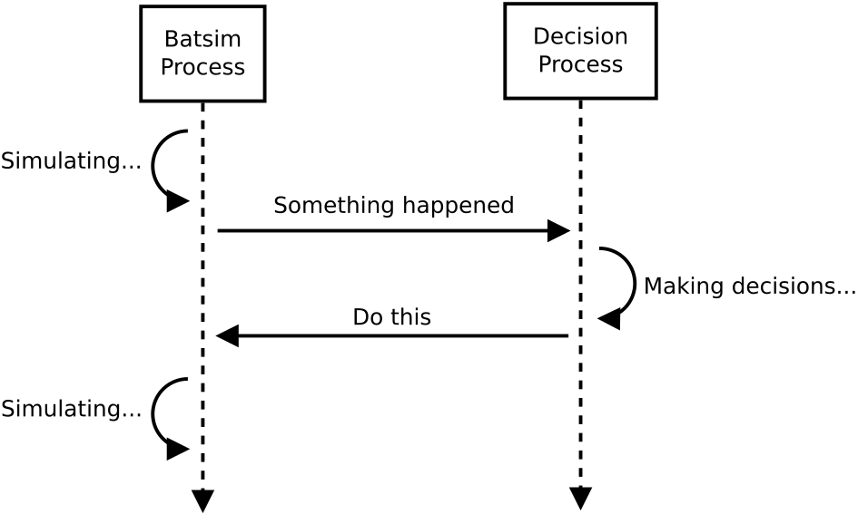
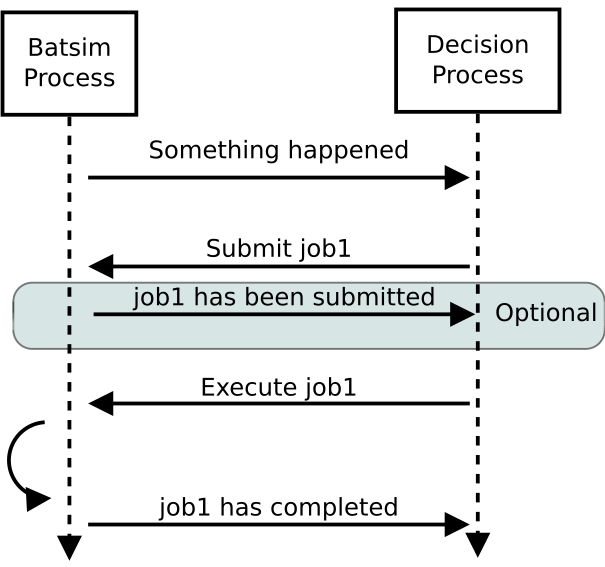

.. _protocol:

Protocol
========

A Batsim simulation consists in two main parts:

- Batsim itself, in charge of simulating what happens on the platform.
- An *External Decision Component* (EDC), in charge of making decisions.

The two parts communicate via a protocol, called the *batprotocol*.
The protocol is synchronous and follows a simple request-reply pattern.
Whenever an event which may require making decision occurs in Batsim during the simulation, the following steps occur:

1. Batsim suspends the simulation
2. Batsim sends a request to the EDC, telling it what happened on the platform
3. Batsim waits and receives the reply from the EDC (blocking call)
4. Batsim resumes the simulation, applying the decisions which have been made

The communication between Batsim and the EDC depends on whether the EDC is connected as a library or as a process (see also :ref:`EDC implementation<tuto_sched_implem>` for more details).

Communication with an EDC process is performed by exchanging messages using the `ZeroMQ request-reply pattern`_.
Batsim uses a ZMQ REQ socket to send its messages to the EDC, while the EDC uses a ZMQ REP socket to send its replies.

Communication with an EDC library is performed by calling specific functions that must be implemented by the library.

Initialization phase
--------------------

During the initialization phase of Batsim, and before the simulation can start, there is a handshake between Batsim and the EDC.

First, Batsim sends a message containing the string of initialization data of the EDC, as provided by the :ref:`cli` arguments.
The message is binary-formatted and contains the size of the initialization string buffer and the initialization string itself.

Then the EDC answers with a message containing two parts.
The first part contains initialization flags.
There is currently one flag expected by Batsim: the serialization format that will be used to exchange messages via the batprotocol.
The flag value ``0x1`` should be selected to use Flatbuffer's binary format, and flag value ``0x2`` to use the JSON format.
The second part contains a protocol message which must be formatted using the format defined in the flags.
This protocol message must contain only one event: ``EDCHelloEvent``.

The ``EDCHelloEvent`` contains multiple informations on the EDC, such as its name, version and the version of the batprotocol it uses, and a set of requested simulation features.
See ``EDCHelloEvent`` and `Simulation features`_ for more details.

.. note::
    When using EDC as a library the messages exchanged with Batsim are not sent/received, but transmitted via the library API.
    During the initialization phase, Batsim calls the EDC library's ``batsim_edc_init`` function.
    The string of initialization data can be retrieved from the parameters ``init_data`` and ``init_size``.
    The EDC must fill the parameters ``flags`` with the flags, and must fill the ``reply_data`` and ``reply_size`` parameters with the protocol message containing the ``EDCHelloEvent`` correctly formatted.

.. _simulation_features:

Simulation features
-------------------

The behavior of specific events of this protocol depends on the simulation features that are requested in the ``EDCHelloEvent``.

Here is the list of the simulation features that may be requested:

- ``dynamic_registration``: If set to ``true`` the dynamic registration of jobs and profiles will be enabled for this EDC. This means the EDC must send a ``FinishRegistrationEvent`` so the simulation can end.
- ``profile_reuse``: If set to ``true`` any existing profile can be used to register dynamic jobs. Otherwise the EDC must make sure that the desired profile has not been garbage collected from Batsim's memory (which happens when the last job that references a profile completes) when registering a job.
- ``acknowledge_dynamic_jobs``: If set to ``true`` Batsim will emit a ``JobSubmittedEvent`` to this EDC when the EDC registers a job.
- ``forward_profiles_on_job_submission``: If set to ``true`` Batsim will include profiles information in ``JobSubmittedEvent``.
- ``forward_profiles_on_jobs_killed``: If set to ``true`` Batsim will include profile information in ``JobsKilledEvent``.
- ``forward_profiles_on_simulation_begins``: If set to ``true`` Batsim will include profile information in ``SimulationBeginsEvent``.

Message composition
-------------------

The communication uses the *Batprotocol* to ease the reading and writing of messages and simulation events, which internally relies on `Flatbuffer`_.
The protocol supports serialization of messages in binary or as a JSON object.

A message contains two fields: the ``now`` field and the ``events`` field.
The ``now`` field (float value) is a timestamp that defines the current simulation time.

- If the message comes from Batsim, it means that the EDC cannot make decisions before ``now`` as it would change the past.
- If the message comes from the EDC, it tells Batsim that the EDC finished making its decisions at timestamp ``now``.
  This is used by Batsim to know when the EDC will be available for making new decisions.

The ``events`` field defines a sequence of events.
Each event must contain a field ``timestamp`` and there are constraints on their values:

- The message timestamp ``now`` **must** be greater or equal to every event ``timestamp``.
- In the sequence of events (field ``events`` of a message), the event timestamps **must** be in (non-strictly) ascending order.

The various event types are defined in details in the `Batprotocol API`_.
See `Table of Events`_ below for a quick list.
The behavior of specific events of this protocol depends on the requested `Simulation features`_ asked by the EDC during the initialization phase of the simulation.

.. note::
    When using EDC as a library the messages exchanged with Batsim are not sent/received, but transmitted via the library API.
    During the simulation loop, Batsim calls the EDC library's ``batsim_edc_take_decisions`` function.
    The content of the message from Batsim can be retrieved from the parameters ``what_happened`` and ``what_happened_size``.
    The answer message of the EDC must be put in the ``decisions`` and ``decisions_size`` parameters.

Table of Events
---------------

Details on every events can be found in the `Batprotocol API`_.

.. todo::
    Put a link for each event to the Batprotocol documentation

Events from Batsim to the External Decision Component:

* SimulationBeginsEvent
* SimulationEndsEvent
* SimulationErrorEvent
..
* JobSubmittedEvent
* JobCompletedEvent
* JobsKilledEvent
..
* RequestedCallEvent
* AllStaticJobsHaveBeenSubmittedEvent
* AllStaticExternalEventsHaveBeenInjectedEvent
* ExternalEventOccurredEvent
..
* HostsPStateChangedEvent
* HostsTurnedOnOffEvent

Events from the External Decision Component to Batsim:

* EDCHelloEvent
* ForceSimulationStopEvent
..
* ExecuteJobEvent
* RejectJobEvent
* KillJobsEvent
..
* RegisterProfileEvent
* RegisterJobEvent
* FinishRegistrationEvent
..
* CallMeLaterEvent
* StopCallMeLaterEvent
..
* CreateProbeEvent
* StopProbeEvent
* TriggerProbeEvent
* ResetProbeEvent
* ProbeDataEmittedEvent
..
* ChangeHostsPStateEvent
* TurnOnOffHostsEvent

.. _dynamic_job_registration:

Dynamic registration of jobs and profiles
-----------------------------------------

Jobs are in most cases given as Batsim inputs, which are submitted by Batsim (the EDC knows about them via ``JobSubmittedEvent`` events of the batprotocol).

However, jobs can also be submitted from the EDC (via registration events) throughout the simulation.
For this purpose:

- Dynamic jobs registration **must** be enabled (see `Simulation features`_).
- The EDC **must** tell Batsim when it has finished registering dynamic jobs (via a ``FinishRegistrationEvent``).
  Otherwise, Batsim will wait for new simulation events forever, causing either a SimGrid deadlock or an infinite loop at the end of the simulation.
- The EDC **must** make sure that Batsim has enough information to avoid SimGrid deadlocks during the simulation.
  If at some simulation time all Batsim workloads inputs have been executed and nothing is happening on the platform, this might lead to a SimGrid deadlock.
  If the EDC knows that it will register a dynamic job in the future, it should ask Batsim to call it at this timestamp via a ``CallMeLaterEvent``.

The protocol behavior of dynamic registrations is customizable (see `Simulation features`_).
Batsim might or might not send acknowledgments when jobs have been registered.

An example of dynamic jobs and profiles registration can be found in the ``dyn-register`` `EDC library`_ of Batsim's tests.

The following figure outlines how a dynamic job registration should be done

.. todo::

    Update the dyn-register EDC library link to the master branch

.. _ZeroMQ request-reply pattern: https://zguide.zeromq.org/docs/chapter1/#Ask-and-Ye-Shall-Receive
.. _Flatbuffer: https://flatbuffers.dev/
.. _Batprotocol API: https://framagit.org/batsim/batprotocol/-/blob/main/docs/api.rst?ref_type=heads
.. _EDC library: https://framagit.org/batsim/batsim/-/blob/batprotocol/test/edc-lib/dyn-register.cpp
