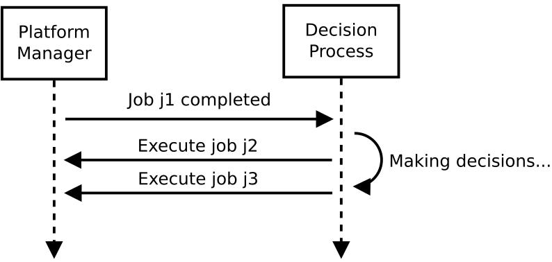
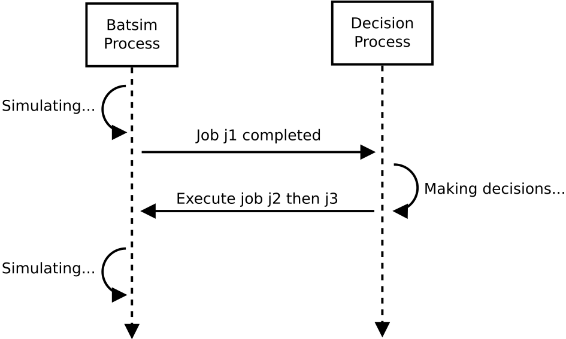
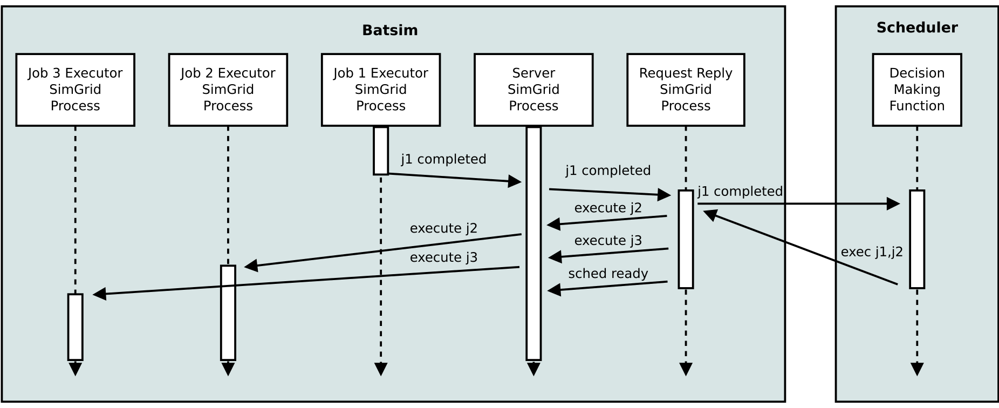
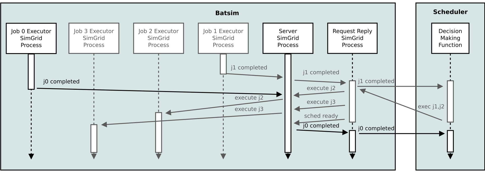

.. _time_dilation:

Progression of simulation time
==============================

In a real system, resource management procedures are called from time to time to take some decisions.
This example shows how the simulation time is managed in Batsim.
It stresses how decision making time can be taken into account in the simulation.

This case study consists in taking the decision to execute two jobs (``j2`` and ``j3``) when job ``j1`` completes.
The important point here is that the decision-making procedure takes some time and takes the decision in an online fashion:
The decision to execute ``j2`` is made before the decision to execute ``j3``, and here we want to inject the scheduling time into the simulation.

Message exchange overview
-------------------------

As a reminder, a Batsim simulation involves two processes that communicate via the Batsim :ref:`protocol`.
Here is a figuration of this case study.

Concretely, the message sent from Batsim to the Scheduler looks like this.

.. code-block:: json

    {
      "now": 10.000000,
      "events": [
        {
          "timestamp": 10.000000,
          "type": "JOB_COMPLETED",
          "data": {
            "job_id": "w0!1",
            "status": "SUCCESS"
          }
        }
      ]
    }

- At time ``10``, job ``1`` (from workload ``w0``) completed successfully.
- The scheduler has been called at time 10 (``"now": 10.000000``). It means that the decisions can be taken at time 10 **or later on**.

The message replied by the Scheduler looks like this.

.. code-block:: json

    {
      "now": 15.0,
      "events": [
        {
          "timestamp": 13.0,
          "type": "EXECUTE_JOB",
          "data": {
            "job_id": "d4c32e!2",
            "alloc": "0-1"
          }
        },
        {
          "timestamp": 14.0,
          "type": "EXECUTE_JOB",
          "data": {
            "job_id": "d4c32e!3",
            "alloc": "2-3"
          }
        }
      ]
    }

This message means that the scheduler:

- (Did something until time ``13``, since the request has been sent at time ``10`` and that the first event is at time ``13``.)
- First chose, at time ``13``, to execute job ``2`` on machines ``0`` and ``1``.
- (Did something until time ``14``, since the next event is at time ``14``.)
- Then chose, at time ``14``, to execute job ``3`` on machines ``2`` and ``3``
- (Did something until time 15, since the reply has been received at ``"now": 15.0``)
- Finally chose to stop taking decisions for now, at time ``15``.

What happens within Batsim?
---------------------------

Batsim can be seen as a distributed application composed of different processes.
These processes may communicate with each other, and spawn other processes.

The main process is the **server**. It is started at the beginning of the simulation, and it ends when the simulation has finished.
It orchestrates most of the other processes:

- **request reply** processes, in charge of communicating with the scheduler.
- **job executor** processes, in charge of executing jobs.
- **waiter** processes, in charge of handling :ref:`proto_CALL_ME_LATER` events.
- etc.

What happens within Batsim for the case study 1 is the following.

First, a **job executor** process finishes to execute job ``j1``.
It sends a message about it to the **server** then terminates.
When the server receives the message, it spawns a **request reply** process to forward that ``j1`` has completed.

The newly spawned **request reply** process sends a network message to the scheduler, forwarding that ``j1`` has completed.
The **request reply** process then waits for the scheduler's reply: **The simulation is *stopped* as long as the reply has not been received**.
Once the reply from the scheduler has been received, the **request reply** process role is to forward the events to the server at the right times.
For this purpose, it sends the events in order, sleeping between events if needed.

Once all the events have been forwarded, the **request reply** process sends a ``SCHED_READY`` message to the **server**.
This message means that all the events coming from the scheduler have been sent, and that the scheduler is now ready to be called if needed.

Events received by the **server** that must be forwarded to the scheduler are queued in a data structure kept in memory.
If the scheduler is ready, the queued event is sent immediately.
Otherwise, the queued events will be sent as soon as possible — i.e., when the next ``SCHED_READY`` event will have been received.
This mechanism ensures that scheduler calls are consistent in time.

- If the scheduler replied at time ``t`` (``now`` field of the reply message), the next call to the scheduler is ensured to occur at a time greater than or equal to ``t``.
- When the scheduler is called, it is sure that all its previous decisions have been initiated.

What if something happened during the scheduler call?
-----------------------------------------------------

Please remark that this mechanism implies that schedulers — that wish to take scheduling time into account — may receive messages from the *past* when they are called.
Batsim can indeed send messages whose events occurred between the last call time (``now`` field of the previous request message sent by Batsim) and the current one (``now`` field of the current request message).

For example, imagine the same scenario as before but with a job ``j0`` that finishes at time ``13.1``.
The scheduler is taking decisions at this time (until time ``15``).
Hence, the scheduler will finish its decision-making procedure and then be called as follows.

The Batsim request message would look like this.

.. code-block:: json

    {
      "now": 15.001000,
      "events": [
        {
          "timestamp": 13.100000,
          "type": "JOB_COMPLETED",
          "data": {
            "job_id": "d4c32e!0",
            "status": "SUCCESS"
          }
        }
      ]
    }

- Job ``j0`` finished at time ``13.1`` successfully.
- The current time is ``15.001``. Therefore, the scheduler can only take decisions at time ``15.001`` or afterwards.
