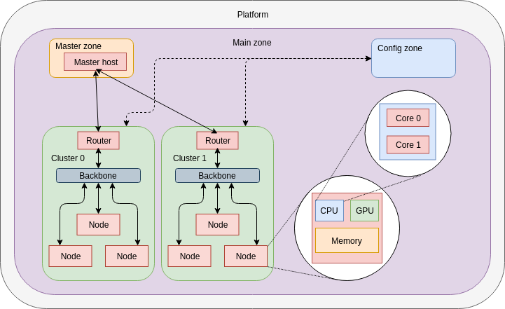

# Heterogeneous platforms

## Principle

Batsim allows for the simulation of homogeneous systems with ease. However, one might need to model different kinds of nodes / processors inside a data centre or a cloud environment: distinct memory availability, processor type based scheduling, ...  
Even though SimGrid does not support this, it provides user-defined properties which bring flexibility to the simulation.

## Design

Fundamental architecture approach:

-   **Platform**: root element for SimGrid platform descriptions.

    -   **Main zone**: top-level zone with *Full* routing; interconnects the master host with the set of clusters.

        -   **Master zone**: contains and isolates the master host.

            -   **Master host**: processes communication with the decision system and job submissions.

        -   **Config zone**: holds user defined properties associated to node and processor types.

        -   **Clusters**: groups of heterogeneous nodes in the data centre.

            -   **Router**: provides connectivity with the master host and thus job allocation.

            -   **Backbone**: intra-cluster communications.

            -   **Nodes**: computational resources integrating one or more types of processors.

                -   **Processors**: computing devices, can be CPUs, GPUs, MICs or whichever defined.

                    -   **Cores**: individual computing units inside a processor, homogeneous within the processor.

                -   **Memory**: amount of storage shared by all processors in the node.

Energy and computational power are expressed per core for fine grain analysis. Cores are SimGrid *hosts*, so they are considered as individual resources.  
Network types apply to both the node up / down links, the cluster backbones and the global links in the main zone.

## Requirements

-   [LXML](https://pypi.org/project/lxml/) Python package

## Usage

You may define:
-   Node types in `node_types.json`
-   Processor types in `processor_types.json`
-   Network types in `network_types.json`

Create a JSON file with the platform description, `example.json` shows a possible template.

Once integrated, feed it into the Python script for generation:

`./generate_platform.py -p <your-platform.json>`
